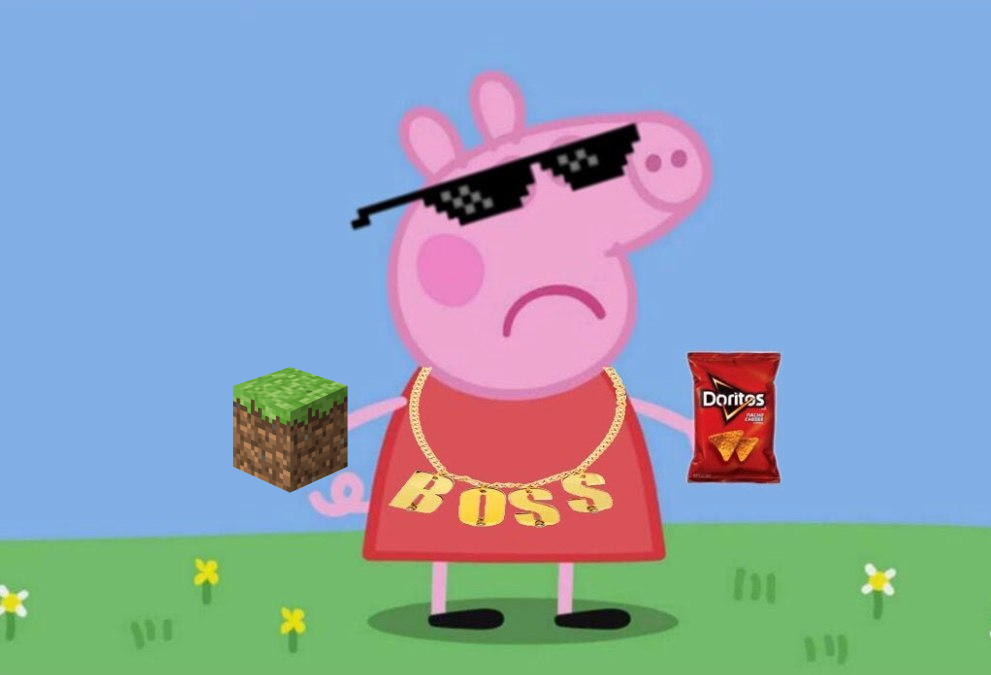

# 🚀 PEPPASORG

PEPPASORG is a system that integrates a Telegram bot and a Minecraft server in GCP, allowing remote control and server automation along with dynamic responses in chat.

## Main Features

- **Telegram Bot**: Uses `Telegraf` to interact with the Telegram API, `node-fetch` for HTTP requests, and `GiphyFetch` to integrate GIF search.
- **Minecraft Server**: An instance on GCP allows players to access a persistent Minecraft world, with the ability to control the state of the server through the Telegram bot.
- **Deployment in GCP**: The steps to deploy the Telegram bot as a serverless function in Google Cloud Run and the VM for the Minecraft server are detailed.

Bot commands include:

- `/prender_servercito`: Starts the server and responds with a game GIF.
- `/apagar_servercito`: Stops the server and responds with a sleepy GIF.



# Index

1. [Introduction](#-peppasorg)
2. [Minecraft Server Configuration](#-minecraft-server-config)
3. [Telegram Bot Deployment](#-telegram-bot-deployment-optional)
4. [Getting API Tokens and Credentials](#-getting-api-tokens-and-credentials)
5. [Minecraft Server Configuration and Administration](#-minecraft-server-configuration-and-administration)
6. [Development](#-development)
7. [Support and Documentation](#-support-and-documentation)
8. [Contributors](#-contributors)

## 📦 Minecraft Server Configuration

👉 You will be asked to enable compute.googleapis.com to create the virtual machine where the Minecraft server will run.

### Get a Static Public IP on Google Cloud Platform

1. Reserve a static IP address in GCP:
    ```bash
    gcloud compute addresses create minecraft-static-ip --region=us-central1
    ```

### 🐷 Minecraft Server VM Deployment

1. Create a VM instance in GCP with the following command:
    ```bash
    SERVER_GCP_ZONE=us-central1-a
    SERVER_GCP_NAME=minecraft-server
    SERVER_GCP_MACHINE_TYPE=e2-standard-4
    USERNAME=$(whoami)
    gcloud compute instances create $SERVER_GCP_NAME \
     --zone=$SERVER_GCP_ZONE \
     --machine-type=$SERVER_GCP_MACHINE_TYPE \
     --boot-disk-size=20GB \
     --image-family=debian-10 \
     --image-project=debian-cloud \
     --tags=$SERVER_GCP_NAME \
     --address=minecraft-static-ip \
     --metadata username=$USERNAME,startup-script='#!/bin/sh
    USERNAME=$(curl -s "http://metadata.google.internal/computeMetadata/v1/instance/attributes/username" -H "Metadata-Flavor: Google")
    mkdir -p /home/minecraft && \
       git clone https://github.com/LuisCusihuaman/peppasorg.git /home/minecraft && \
       mkdir -p /home/minecraft/mods && \
       chown -R $USERNAME:$USERNAME /home/minecraft
    curl -fsSL https://get.docker.com -o get-docker.sh && sh get-docker.sh && usermod -aG docker $USERNAME
    cd /home/$USERNAME/ && sudo -u $USERNAME docker compose up -d'
    ```

💸 PRICING: [$104.82/ mo](https://cloud.google.com/products/calculator/estimate-preview/5c08ef3e-87c1-4310-9f08-5cc4c3870264?hl=es_419)

### Configure Firewall Rules

1. Add firewall rules to allow traffic on the necessary ports:
    ```bash
    gcloud compute firewall-rules create allow-25565-8080 \
        --allow tcp:25565,tcp:8080 \
        --target-tags=$SERVER_GCP_NAME \
        --description="Allow traffic on port 25565 (MINECRAFT SERVER) and 8080 (FILE SERVER)"
    ```

## 🤖 Deployment of the Telegram Bot (OPTIONAL)

👉 You will be asked to enable cloudbuild.googleapis.com and run.googleapis.com (IT WILL TAKE A TIME) for the construction and deployment of the bot.

### Setting permissions for the Minecraft service account

1. **Create the service account**:

    ```bash
    gcloud iam service-accounts create minecraft-server-account --display-name "Minecraft Server Account"
    ```

2. **Get your project ID automatically**:

    ```bash
    PROJECT_ID=$(gcloud config get-value project)
    echo $PROJECT_ID
    ```

3. **Create a custom role** with the necessary permissions to start and stop the Minecraft instance:

    ```bash
    gcloud iam roles create minecraft_instance_control --project $PROJECT_ID --title "Minecraft Instance Control" --description "Custom role for starting and stopping Minecraft instance" --permissions compute.instances.start,compute.instances.stop,compute.instances. list,compute.zoneOperations.get,compute.zoneOperations.list
    ```

4. **Assign the custom role to the service account**:

    ```bash
    gcloud projects add-iam-policy-binding $PROJECT_ID --member="serviceAccount:minecraft-server-account@$PROJECT_ID.iam.gserviceaccount.com" --role=projects/$PROJECT_ID/roles/minecraft_instance_control
    ```

5. **Generate the JSON key file** for the service account:

    ```bash
    gcloud iam service-accounts keys create ./my_credentials.json --iam-account=minecraft-server-account@$PROJECT_ID.iam.gserviceaccount.com
    ```

### Deployment of the Bot in Google Cloud Run

1. **Clone the bot repository**:
   First, clone the Telegram bot repository to your local or development environment:

    ```shell
    git clone https://github.com/LuisCusihuaman/peppasorg.git peppasorg-bot
    ```

2. **Copy the credentials file**:
   Copy `my_credentials.json` to the cloned project directory:

    ```shell
    cp my_credentials.json peppasorg-bot/
    ```

3. **Build the container image and upload it to Container Registry**:
   From the project directory, build and upload the image directly to Google Container Registry:

    ```shell
    PROJECT_ID=$(gcloud config get-value project)
    gcloud builds submit --tag gcr.io/$PROJECT_ID/peppasorg-bot peppasorg-bot/
    ```

4. **Deploy to Cloud Run**:
   Use the following command to deploy your bot:

    ```shell
    SERVER_GCP_REGION=us-central1
    SERVER_GCP_ZONE=us-central1-a
    SERVER_GCP_NAME=minecraft-server
    GIPHY_TOKEN=your-giphy-token
    BOT_TOKEN=your-bot-token
    gcloud run deploy peppasorg-bot \
    --image gcr.io/$PROJECT_ID/peppasorg-bot \
    --platform managed \
    --region $SERVER_GCP_REGION \
    --allow-unauthenticated \
    --set-env-vars PRODUCTION='true',\
    SERVER_GCP_NAME=$SERVER_GCP_NAME,\
    SERVER_GCP_ZONE=$SERVER_GCP_ZONE,\
    GIPHY_TOKEN=$GIPHY_TOKEN,\
    BOT_TOKEN=$BOT_TOKEN
    ```

5. **Configure the Telegram webhook**:
   Configure the Telegram webhook so that the bot can receive message updates:

    ```shell
    CLOUD_RUN_URL=$(gcloud run services describe peppasorg-bot --region $SERVER_GCP_REGION --format 'value(status.url)')
    curl -F "url=${CLOUD_RUN_URL}/bot${BOT_TOKEN}" https://api.telegram.org/bot${BOT_TOKEN}/setWebhook
    ```

   Replace `your-bot-token` with your Telegram bot token, `your-giphy-token` with your Giphy API token.

This process will clone the bot repository, copy the necessary credentials file to the project directory, build the container image, and deploy it to Google Cloud Run.

## 🔑 Getting API tokens and credentials

### 🤖 Telegram bot token

1. Open the Telegram app and search for the “BotFather” bot.
2. Start a chat with BotFather and send the command `/newbot`.
3. Follow the prompts to create a new bot and get your bot token.

### 🎞️ Giphy Token

1. Go to [Giphy Developer Portal](https://developers.giphy.com/).
2. Create a new app and get your Giphy API key.

### ☁️ Google Cloud Platform Credentials

1. Go to the [Google Cloud Console](https://console.cloud.google.com/).
2. Create a new project or select an existing one.
3. Navigate to "APIs and services" > "Credentials".
4. Click "Create Credentials" and select "Service Account".
5. Follow the prompts to create a new service account and download the JSON key file.

After obtaining these tokens and credentials, place the GCP JSON key file in the root of the project, with the name:

```javascript
const options = {
  keyFilename: './my_credentials.json',
};
```

## 👮 Minecraft Server Configuration and Administration

**Execute any of these commands in RCON**:

RCON_PASSWORD=password

```bash
docker compose exec mc rcon-cli list
docker compose exec mc rcon-cli say "Hello gamers"
docker compose exec mc rcon-cli op <player> #Give administrator permissions
docker compose exec mc rcon-cli deop <player> #Remove administrator permissions
docker compose exec mc rcon-cli whitelist add <player>
docker compose exec mc rcon-cli whitelist remove <player>
docker compose exec mc rcon-cli ban <player>
docker compose exec mc rcon-cli ban-ip <ip>
docker compose exec mc rcon-cli pardon <player>
docker compose exec mc rcon-cli pardon-ip <ip>
docker compose exec mc rcon-cli save-all
docker compose exec mc rcon-cli save-off
docker compose exec mc rcon-cli save-on
docker compose exec mc rcon-cli stop
```

**Configure the minecraft.env with the following environment variables**:

[Minecraft Server Documentation](https://docker-minecraft-server.readthedocs.io/en/latest/variables/)

## 💻 Development

1. Export the necessary environment variables in your terminal:

    ```bash
    export SERVER_GCP_NAME=minecraft-server
    export SERVER_GCP_ZONE=us-central1-a
    export BOT_TOKEN=your-bot-token
    export GIPHY_TOKEN=your-giphy-token
    ```

2. Copy the GCP credentials file `my_credentials.json` to the project directory.
3. Run `pnpm install` to install the necessary dependencies.
4. Run `pnpm start` to start the development server.

## 📚 Support and Documentation

For more information and troubleshooting, see the following resources:

- [Telegram Bot API Documentation](https://core.telegram.org/bots/api)
- [Giphy API Documentation](https://developers.giphy.com/docs/api/)
- [Google Cloud Platform Documentation](https://cloud.google.com/docs)

## 🤝 Contributors

This project has been possible thanks to the collaboration of the following contributors:

| Contributor                                                         | Profile                                                 |
|----------------------------------------------------------------------|---------------------------------------------------------|
|  | [Eduardo Cusihuaman](https://github.com/LuisCusihuaman) |
|           | [Eddy Vega](https://github.com/EddyVegaGarcia)          |

We appreciate your dedication and effort in carrying out this project!
